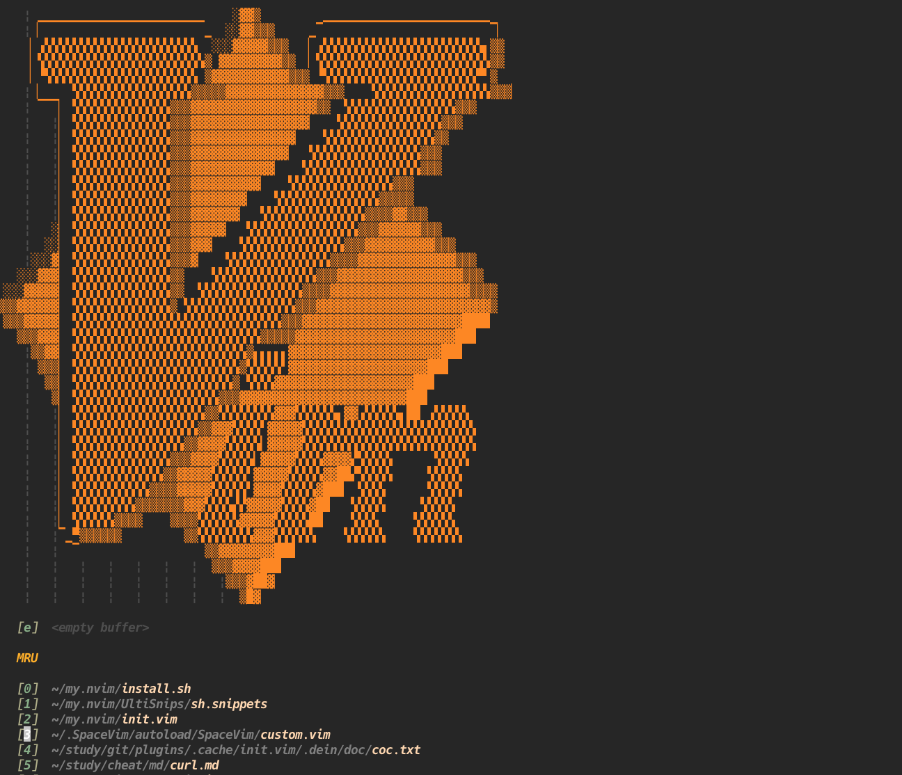
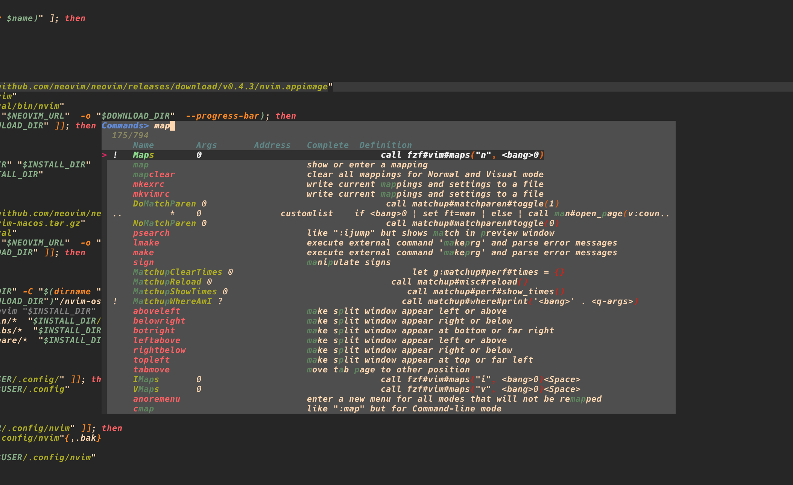
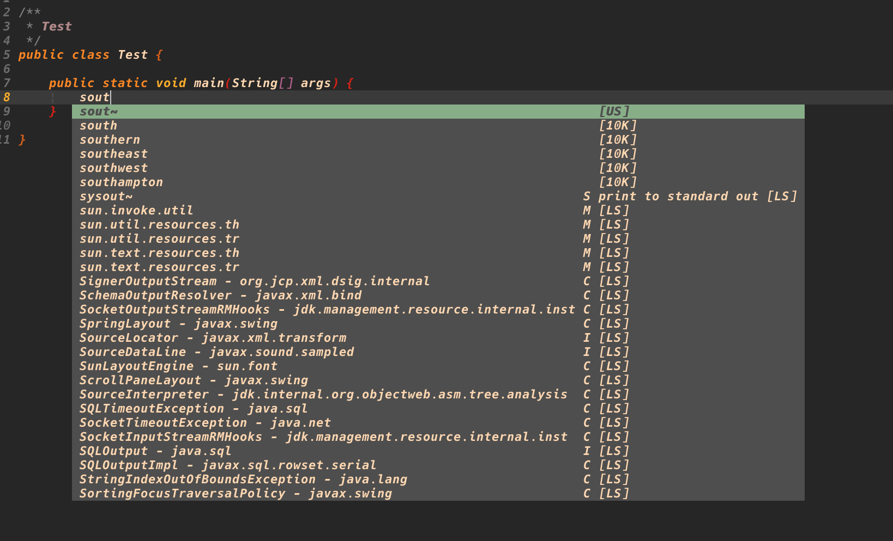
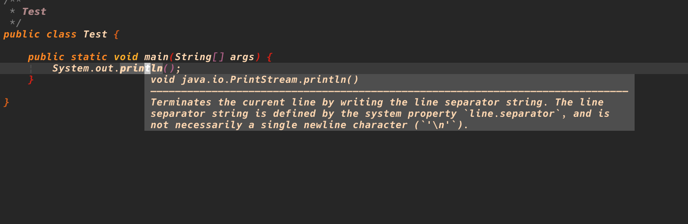

# 仿VsCode的Vim配置

## 简介

使用最新的neovim，仿照VsCode的操作方式，使用coc.nvim提供强大的补全功能。

## 截图

## 依赖

+ fzf: 最重要的组件，提供搜索列表等功能
+ Ag， Rg: 提供模糊搜索功能
+ node: coc.nvim依赖node来运行

## 安装

### 手动安装

1. 手动安装fzf、rg、ag
2. 安装4.0以上的neovim
3. 将本配置文件clone到~/.confg/nvim中
4. 手动clone dein和dein-ui项目并手动修改配置文件里面的DEIN,PLUGINS路径
5. 修改fzf的安装路径
6. 打开neovim，等待自动安装插件完成
7. 使用CocInstall安装一些你需要的coc.nvim插件

### 脚本安装

**注意安装脚本没有完全测试过，所以目前还是建议你手动进行安装，如果你还是想要使用脚本安装的话，请在执行之前最好先读一下脚本!**

curl -fsSL https://raw.githubusercontent.com/beardnick/my.nvim/master/install.sh | bash

## 其它注意事项

1. coc.nvim安装出问题: 尝试 `:call coc#util#install()`
2. coc必装插件: coc-git, coc-ultisnips, coc-explorer, coc-pairs. 其他语言类插件如:coc-java, coc-python
3. 查看keymap: `:Verbose map` 或者 `:Maps`

